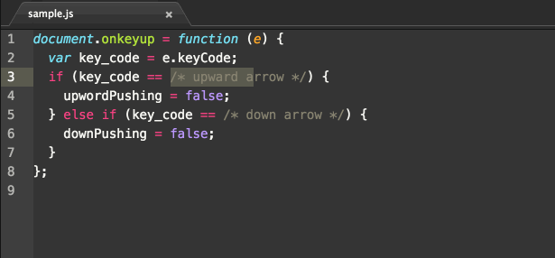

keycode-insert package
====

To insert the keycode what you push in Atom.

## Demo



## Usage

Install this package in Atom, then...

* from Menu, [ Packages ] -> [ Keycode Insert ] -> [ Insert ]  
* from Right Click, [ Insert keyCode ]
* from Shortcut, ```Option(⌥) + Shift(⇧) + i``` for Mac, and ```Alt + Shift + i``` for Windows

## How to Contribute

I am waiting for you to:

1. Fork it ( https://github.com/changami/atom-keycode-insert/fork )
2. Create your feature branch ```$ git checkout -b your-new-feature```
3. Commit your changes ```$ git commit -am 'Add some feature'```
4. Push to the branch ```$ git push origin your-new-feature```
5. Create new Pull Request

## Licence

[MIT License](https://github.com/changami/atom-keycode-insert/blob/master/LICENSE.md)

## Author

[chan_gami](https://github.com/changami)